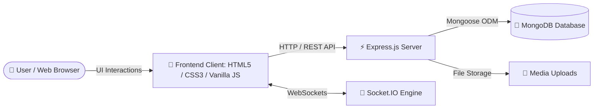
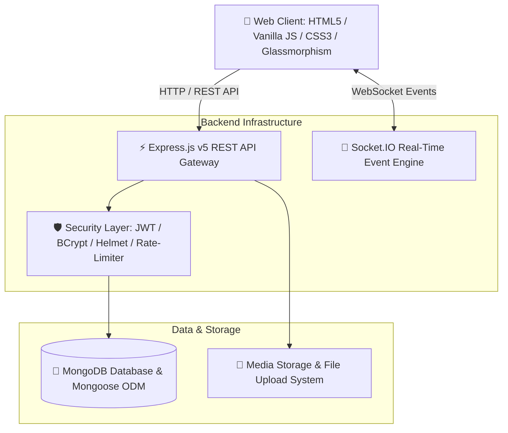
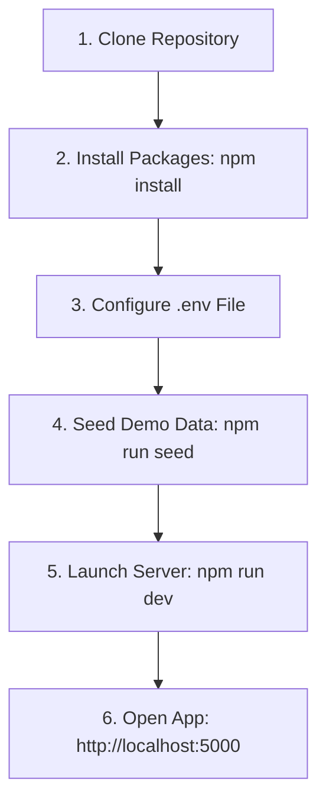

<div align="center">

# ⚡ ConnectHub
### Modern Full-Stack Social Media Platform | Portfolio Project

<p align="center">
  
</p>

[](https://github.com/tedrosweldegebriel465-eng/ConnectHub)
[](https://github.com/tedrosweldegebriel465-eng/ConnectHub/stargazers)
[](https://github.com/tedrosweldegebriel465-eng/ConnectHub/network/members)
[](https://github.com/tedrosweldegebriel465-eng/ConnectHub/issues)
[](https://nodejs.org/)
[](https://expressjs.com/)
[](https://www.mongodb.com/)
[](https://socket.io/)
[](LICENSE)

<p align="center">
  <b>⚡ ConnectHub</b> is a modern full-stack social media and short-video sharing platform built with <b>Node.js, Express, MongoDB, Socket.IO, and native JavaScript</b>.
  <br />
  Featuring seamless real-time social networking, dynamic feeds, multi-category safety moderation, age-gating compliance, and <b>ConnectClips</b> — a smooth vertical short video experience.
</p>

[Live Demo](#-live-demo--repository) •
[Highlights](#-project-highlights) •
[Scale](#-project-scale--metrics) •
[Features](#-core-feature-checklist) •
[Screenshots](#-screenshots--visual-tour) •
[Architecture](#-system-architecture) •
[Quick Start](#-quick-start-guide) •
[Author](#-author--contact)

---

</div>

## 🌐 Live Demo & Repository

| Gateway | Link / Status |
| :--- | :--- |
| 🚀 **Live Application** | *Live Demo Coming Soon* |
| 💻 **GitHub Repository** | [https://github.com/tedrosweldegebriel465-eng/ConnectHub](https://github.com/tedrosweldegebriel465-eng/ConnectHub) |

---

## 🎯 Project Overview

**ConnectHub** was engineered as a full-stack portfolio platform demonstrating modern web development practices, real-time communication, robust backend architecture, scalable database modeling, and fluid responsive user interfaces. The project showcases production-ready security, media handling, and real-time social engagement built with native web technologies.

<div align="center">
  <h3>📸 Main Feed Preview</h3>
  <a href="uploads/screenshots/Feed.png">
    
  </a>
</div>

---

## ⭐ Project Highlights

- 🚀 **Modern Full-Stack Architecture**: Clean decoupling of HTML5 client layer and Express.js RESTful API server.
- 🔒 **Hardened Authentication**: JWT session persistence with BCrypt password hashing (10 salt rounds).
- 💬 **Sub-Millisecond Messaging**: Bi-directional WebSockets powered by Socket.IO for instant chat and status indicators.
- 🎨 **Glassmorphism UI System**: Responsive layout with CSS Custom Properties, smooth dark/light mode toggle, and micro-animations.
- 🎬 **Vertical Short Video Stream**: Fullscreen short video feed with IntersectionObserver autoplay.
- 🍃 **Database Schemas**: Relational-like Mongoose ODM schemas for Users, Posts, Comments, Messages, Stories, and Reports.
- 🍪 **Animated Cookie Consent**: Interactive dark-mode cookie banner with particle burst effects.

---

## 📈 Project Scale & Metrics

| Category | Count |
| :--- | :---: |
| 📱 **HTML5 Client Pages** | **12** Pages |
| 🎨 **CSS Stylesheets** | **11** Modules |
| ⚡ **JavaScript Modules** | **15** Client Files |
| ⚙️ **Backend Controllers** | **8** Controllers |
| 📡 **REST API Endpoints** | **20+** Routes |
| 🍃 **MongoDB Models** | **7** Schemas |
| 📸 **High-Res Screenshots** | **9** Previews |

---

## ✅ Core Feature Checklist

- [x] **Secure Authentication**: BCrypt password hashing & JWT session verification
- [x] **Invite-Gated Access**: Invitation code enforcement & 13+ age gating compliance
- [x] **Interactive Social Feed**: Rich text, multi-image galleries, video embeds, and dynamic polls
- [x] **24-Hour Stories**: Temporary media updates with automatic 24-hour expiration
- [x] **ConnectClips Short Videos**: Fullscreen vertical video stream with IntersectionObserver autoplay
- [x] **Real-Time Messaging**: Instant chat powered by Socket.IO with unread badges & status
- [x] **Threaded Comments & Reactions**: Multi-reaction choices (Like, Heart, Fire) and comment threads
- [x] **Saved Content & Bookmarks**: Personal media bookmarking library
- [x] **Content Safety & Moderation**: User safety reporting pipeline and admin moderation queue
- [x] **Responsive Glassmorphism UI**: Native CSS design system with smooth dark/light mode toggle

---

## 📖 Table of Contents
- [🌟 Key Features](#-key-features)
- [🎯 Skills Demonstrated](#-skills-demonstrated)
- [🖼️ Screenshots & Visual Tour](#-screenshots--visual-tour)
- [🍪 Interactive Cookie Consent & Micro-Animations](#-interactive-cookie-consent--micro-animations)
- [📂 Full Platform Directory Structure](#-full-platform-directory-structure)
- [🏗️ System Architecture & Workflow](#-system-architecture--workflow)
- [🛠️ Tech Stack & Dependencies](#%EF%B8%8F-tech-stack--dependencies)
- [🚀 Quick Start Guide](#-quick-start-guide)
- [⚙️ Environment Variables](#%EF%B8%8F-environment-variables)
- [📡 Core API Reference](#-core-api-reference)
- [☁ Cloud Deployment](#-cloud-deployment-guide)
- [🔮 Future Enhancements](#-future-enhancements--roadmap)
- [🤝 Contributing](#-contributing)
- [🏷️ Repository Topics](#%EF%B8%8F-repository-topics)
- [👤 Author & Contact](#-author--contact)
- [🙏 Acknowledgements](#-acknowledgements)
- [📜 License](#-license)

---

## 🌟 Key Features

### 1. ⚡ ConnectClips Short-Video Feed
* **Vertical Short-Video Stream**: Fullscreen vertical video stream with responsive snap scrolling.
* **Intersection-Observer Autoplay**: Smart viewport detection that automatically plays active clips and pauses hidden ones to save bandwidth.
* **Interactive Overlay UI**: Modern glassmorphism overlay with like counters, interactive comments drawer, bookmarking, creator profile popups, sound mute/unmute toggle, and instant report triggers.

### 2. 📰 Dynamic Social Feed & Engagement
* **Rich Multi-Media Posts**: Create text posts, multi-image galleries, video embeds, and interactive real-time polls.
* **Multi-Reactions & Comments**: Express reactions (Like, Heart, Fire, Laugh, Support) and participate in threaded discussions.
* **24-Hour Stories**: Share temporary media clips and text updates with auto-expiration after 24 hours.

### 3. 💬 Real-Time Direct Messaging
* **Socket.IO Powered Chat**: Sub-millisecond instant messaging with online status indicators, unread notification badges, and real-time message delivery.
* **Saved Content & Bookmarks**: Save posts and media items for quick access in your personal library.

### 4. 🛡️ Hardened Security & Compliance
* **Invite-Only Registration**: Strictly controlled sign-ups requiring valid invite codes (`REGISTRATION_INVITE_CODES` or `ADMIN_INVITE_CODES`).
* **Compliance Age-Gating (13+)**: Mandatory age verification checkbox and DOB validation during account creation.
* **Password Encryption & JWT**: BCrypt password hashing (10 salt rounds) with secure JWT and HTTP-Only session cookies.
* **Centralized Moderation Queue**: Complete reporting pipeline (`/api/reports` & `/api/admin/reports`) allowing administrators to review, action, or dismiss safety reports.

---

## 🎯 Skills Demonstrated

* **REST API Architecture**: Enterprise RESTful endpoints built with Node.js & Express.js.
* **Authentication & Authorization**: Secure JWT token verification, session persistence, and role-based access control.
* **Security & Anti-Abuse**: BCrypt password hashing (10 salt rounds), Helmet HTTP security headers, Express rate limiting, and input sanitization.
* **MongoDB Data Modeling**: Relational-like Mongoose ODM schemas for Users, Posts, Comments, Messages, Stories, and Reports with optimized indexing and populate methods.
* **Real-Time Event Distribution**: Socket.IO bi-directional WebSocket event management for live messaging and active user status indicators.
* **Responsive UI/UX Engineering**: Glassmorphism design system built with Vanilla CSS (CSS Custom Properties, smooth dark/light mode toggle, micro-animations, and fluid typography).
* **Media Handling & File Pipelines**: FileReader API client previews, Multer middleware server pipeline, and HTML5 Video API controls.
* **Git Version Control & Deployment**: Production-ready documentation, structured code architecture, and multi-environment configuration.

---

## 🖼️ Screenshots & Visual Tour

*(Click any screenshot below to view in full size)*

### 📱 1. Sign In & Registration Gating
> Secure authentication flow featuring invite code enforcement and 13+ age verification compliance.

| Sign In Screen | Account Registration Step 1 | Account Registration Step 2 |
| :---: | :---: | :---: |
| [](uploads/screenshots/signin.png) | [](uploads/screenshots/create%20account.png) | [](uploads/screenshots/create%20account1.png) |

---

### ⚡ 2. ConnectClips & Main Social Feed
> Modern vertical short video experience alongside the interactive social newsfeed.

| ⚡ ConnectClips Short Videos | 📰 Main Social Feed |
| :---: | :---: |
| [](uploads/screenshots/ConnectClips.png) | [](uploads/screenshots/Feed.png) |

---

### 🔍 3. Explore, Real-Time Messages & User Profile
> Seamless discovery, direct messaging, saved posts, and comprehensive user profile management.

| 🔍 Explore & Discovery | 💬 Real-Time Direct Messaging |
| :---: | :---: |
| [](uploads/screenshots/Explore.png) | [](uploads/screenshots/Messages.png) |

| 🔖 Bookmarks & Saved Media | 👤 User Profile & Customization |
| :---: | :---: |
| [](uploads/screenshots/BookMarks.png) | [](uploads/screenshots/Profile.png) |

---

## 🍪 Interactive Cookie Consent & Micro-Animations

ConnectHub features a single, custom-designed floating dark-mode Cookie Consent Banner with rich micro-animations:

* **Visual Design**: Sleek rounded pill shape with glassmorphism backdrop blur (`backdrop-filter: blur(16px)`), purple gradient lightning bolt badge, clear privacy disclosures, and glowing violet action button.
* **Success Animation**:
  1. Clicking `✓ Accept` triggers a smooth state transition.
  2. The button background morphs to vibrant emerald green (`#10b981`) with a radial glowing aura.
  3. The checkmark icon performs a spring scale pop animation (`checkPop`).
  4. Button text updates instantly to `✓ Accepted!`.
  5. A particle burst effect launches 14 colorful sparkles around the button.
  6. The banner smoothly slides down and fades out after an 800ms celebration delay.
* **Single Instance Enforcement**: Built-in duplicate detection purges any extra or unwanted banners so only one clean, functional consent banner exists in the DOM.
* **Persistent Preferences**: Consent state is persisted in `localStorage` (`connecthub_cookie_consent`) and HTTP cookies.
* **Testing & Reset**: Users can reset or re-test the animation anytime via the button on `privacy.html` or calling `window.ConnectHubCookieBanner.reset()`.

---

## 📂 Full Platform Directory Structure

```text
ConnectHub/
├── client/                     # Frontend Web Client Application
│   ├── css/                    # Modular Style System
│   │   ├── auth.css            # Authentication pages layout
│   │   ├── bookmarks.css       # Saved posts & bookmarks
│   │   ├── clips.css           # ConnectClips short video feed
│   │   ├── explore.css         # Discovery & trending layout
│   │   ├── feed.css            # Main social newsfeed layout
│   │   ├── icons.css           # SVG & FontAwesome icon utilities
│   │   ├── landing.css         # Landing page section styles
│   │   ├── messages.css        # Real-time chat layout
│   │   ├── post.css            # Post details & comments layout
│   │   ├── profile.css         # Profile customization layout
│   │   └── style.css           # Global design system, dark mode & animated cookie banner
│   ├── js/                     # Frontend Application Modules
│   │   ├── api.js              # Fetch wrapper & API client
│   │   ├── auth.js             # Auth state, validation & form handling
│   │   ├── bookmarks.js        # Bookmarks management
│   │   ├── clips.js            # Short video observer & player controller
│   │   ├── config.js           # Frontend global settings & constants
│   │   ├── cookie-banner.js    # Animated cookie consent banner & micro-interactions
│   │   ├── explore.js          # Search & category discovery engine
│   │   ├── feed.js             # Post rendering, reactions, polls & stories
│   │   ├── icons.js            # SVG icon component registry
│   │   ├── landing.js          # Landing page interactions & counters
│   │   ├── layout.js           # Shared navigation, footer & notifications
│   │   ├── messages.js         # Socket.IO real-time chat client
│   │   ├── post.js             # Threaded post & comments view
│   │   ├── profile.js          # Profile view, edit & user stats
│   │   └── utils.js            # Toast notifications, formatters & helper functions
│   ├── bookmarks.html          # Bookmarks & Saved Media Page
│   ├── clips.html              # ConnectClips Short-Video Feed Page
│   ├── explore.html            # Explore & Trending Discovery Page
│   ├── feed.html               # Main Social Feed Page
│   ├── help.html               # Help Center & Documentation Page
│   ├── index.html              # Landing Page & Marketing Portal
│   ├── login.html              # User Authentication Login Page
│   ├── post.html               # Single Post Detail & Comments Page
│   ├── privacy.html            # Privacy Policy & Cookie Preferences Page
│   ├── profile.html            # User Profile & Activity Page
│   ├── register.html           # Invite-only Registration & Age-gating Page
│   └── terms.html              # Terms of Service Page
├── server/                     # Backend Node.js & Express API Server
│   ├── config/                 # Database & JWT configuration
│   ├── controllers/            # REST API Request Controllers
│   │   ├── authController.js         # Registration, login & profile auth
│   │   ├── commentController.js      # Post comments CRUD
│   │   ├── messageController.js      # Direct messaging & chat history
│   │   ├── notificationController.js # Real-time user notification badges
│   │   ├── postController.js         # Posts, reactions, polls & media
│   │   ├── reportController.js       # Abuse & safety content reporting
│   │   ├── storyController.js        # 24-hour temporary stories
│   │   └── userController.js         # User profiles, follow & block
│   ├── middleware/             # Express Middleware Modules
│   │   ├── authMiddleware.js     # JWT verification & role authorization
│   │   ├── authValidation.js     # Request body payload validation
│   │   ├── errorMiddleware.js    # Global API error handler
│   │   ├── security.js           # Rate limiting & security headers
│   │   └── upload.js             # Multer file upload & storage handler
│   ├── models/                 # Mongoose Data Schemas
│   │   ├── comment.js            # Comment model & reply thread schema
│   │   ├── message.js            # Direct chat message schema
│   │   ├── notification.js       # User notification schema
│   │   ├── post.js               # Social post, poll & reaction schema
│   │   ├── report.js             # Content & user safety report schema
│   │   ├── story.js              # 24h story upload schema
│   │   └── user.js               # User account, credentials & settings schema
│   ├── routes/                 # API Endpoint Router Declarations
│   ├── seeders/                # Database Seeding Scripts
│   ├── services/               # Internal Services & Socket.IO Handler
│   ├── utils/                  # Backend Logger & Utility Functions
│   └── app.js                  # Main Express Server Entry Point
├── tests/                      # Automated Security & Integration Tests
│   ├── security.test.js        # Auth, JWT & Rate limiting tests
│   └── smoke.test.js           # API route & server health tests
├── uploads/                    # User Media & File Storage
│   └── screenshots/            # High-resolution application preview screenshots
├── .env.example                # Template for environment configuration
├── package.json                # Project dependencies & script definitions
└── README.md                   # Technical documentation & repository guide
```

---

## 🏗️ System Architecture & Workflow

### Architectural Data Flow


### System Architecture Diagram


---

## 🛠️ Tech Stack & Dependencies

* **Frontend**: HTML5, Vanilla JavaScript (ES6+), Vanilla CSS (Custom Properties, Glassmorphism design system, smooth dark/light mode toggle, FontAwesome 6 icons, Inter & Plus Jakarta Sans typography).
* **Backend Runtime & Framework**: `Node.js`, `express` (v5.0)
* **Real-Time Protocol**: `socket.io` (v4.8)
* **Database & ODM**: `mongodb`, `mongoose` ODM
* **Security & Auth Packages**: `jsonwebtoken`, `bcryptjs`, `helmet`, `express-rate-limit`, `cors`
* **File Upload & Utilities**: `multer`, `winston`, `dotenv`

---

## 🚀 Quick Start Guide

### Setup Workflow


### Prerequisites
* **Node.js**: `v16.0.0` or higher
* **MongoDB**: Local MongoDB instance (`mongodb://localhost:27017/connecthub_db`) or MongoDB Atlas URI string.

### 1. Clone the Repository
```bash
git clone https://github.com/tedrosweldegebriel465-eng/ConnectHub.git
cd ConnectHub
```

### 2. Environment Configuration
Copy `.env.example` to create your local `.env` configuration:
```bash
cp .env.example .env
```

Set up your environment variables inside `.env`:
```env
PORT=5000
NODE_ENV=development
MONGODB_URI=mongodb://localhost:27017/connecthub_db
JWT_SECRET=your_secure_random_jwt_secret_here
JWT_EXPIRES_IN=7d

# Access Control (Invite Codes)
REGISTRATION_INVITE_CODES=CONNECT2026,DEV2026,SANDBOX2026
ADMIN_INVITE_CODES=ADMIN2026_MASTER
```

### 3. Install Dependencies
```bash
npm install
```

### 4. Seed Demo Data
```bash
npm run seed
```

### 5. Launch the Server
```bash
# Development mode with Nodemon
npm run dev

# Production mode
npm start
```
The server will start on `http://localhost:5000`. You can open the client web application pages directly in any browser or serve them via a static web server.

---

## 📡 Core API Reference

| Method | Endpoint | Description | Auth Required |
| :--- | :--- | :--- | :--- |
| **POST** | `/api/auth/register` | Register new user with invite code & 13+ age verification | No |
| **POST** | `/api/auth/login` | Authenticate user and issue JWT session token | No |
| **GET** | `/api/auth/me` | Retrieve authenticated user profile | **Yes** |
| **GET** | `/api/posts` | Fetch paginated main social feed posts | **Yes** |
| **POST** | `/api/posts` | Create new text, media gallery, video, or poll post | **Yes** |
| **PUT** | `/api/posts/:id/like` | Toggle post reaction (Like, Heart, Fire, etc.) | **Yes** |
| **GET** | `/api/comments/:postId` | Retrieve comments for a specific post | **Yes** |
| **POST** | `/api/comments/:postId` | Submit a new comment | **Yes** |
| **POST** | `/api/reports` | Submit safety, abuse, or content violation report | **Yes** |
| **GET** | `/api/admin/reports` | Fetch pending moderation queue items | **Yes (Admin)** |

---

## ☁ Cloud Deployment Guide

### Frontend (Netlify / Vercel / Render)
1. Connect your GitHub repository to **Vercel** or **Netlify**.
2. Set the root build directory to `client/` (or serve as static HTML5 application).
3. Set your production environment variable `API_BASE_URL` pointing to your deployed API server URL.

### Backend API (Render / Railway / Fly.io)
1. Connect repository to **Render** or **Railway**.
2. Set build command to `npm install` and start command to `node server/app.js`.
3. Configure environment variables (`PORT`, `MONGODB_URI`, `JWT_SECRET`, `NODE_ENV=production`).

### Database (MongoDB Atlas)
1. Create a cloud cluster on **MongoDB Atlas**.
2. Add your deployment server IP to Network Access whitelist.
3. Supply the connection string to `MONGODB_URI` in backend environment settings.

---

## 🔮 Future Enhancements & Roadmap

- 🔐 **OAuth 2.0 Integration**: Single Sign-On via Google and GitHub credentials.
- 🔔 **Web Push Notifications**: Service worker notifications for direct messages and post interactions.
- 🤖 **AI Content Moderation**: Machine learning powered safety scanning for uploaded media and text content.
- 📱 **Progressive Web App (PWA)**: Offline caching, service workers, and installable web manifest.
- 🎬 **HLS Video Transcoding**: Adaptive bitrate streaming and automated short video compression.
- 🔑 **Two-Factor Authentication (2FA)**: Time-based One-Time Password (TOTP) authenticator app support.

---

## 🤝 Contributing

Contributions, issues, and feature requests are welcome!
1. Fork the repository
2. Create a feature branch (`git checkout -b feature/AmazingFeature`)
3. Commit your changes (`git commit -m 'Add some AmazingFeature'`)
4. Push to the branch (`git push origin feature/AmazingFeature`)
5. Open a Pull Request

---

## ⭐ Support

If you found this project helpful or inspiring, please consider giving it a **⭐ star** on GitHub!

---

## 🏷️ Repository Topics

`social-media` • `full-stack` • `nodejs` • `express` • `mongodb` • `socketio` • `jwt` • `javascript` • `html5` • `css3` • `responsive` • `web-development` • `portfolio`

---

## 👤 Author & Contact

<div align="center">

### **Tedros Weldegebriel**
*Aspiring Software Engineer | Full-Stack Developer*

[](https://tedros-dev.netlify.app)
[](https://linkedin.com/in/tedros-dev369)
[](https://github.com/tedrosweldegebriel465-eng)
[](mailto:teddastube@gmail.com)

</div>

### 📫 Direct Contact Info
* **🌐 Portfolio Website**: [https://tedros-dev.netlify.app](https://tedros-dev.netlify.app)
* **💻 GitHub**: [https://github.com/tedrosweldegebriel465-eng](https://github.com/tedrosweldegebriel465-eng)
* **👔 LinkedIn**: [https://linkedin.com/in/tedros-dev369](https://linkedin.com/in/tedros-dev369)
* **✉️ Email**: [teddastube@gmail.com](mailto:teddastube@gmail.com)

---

## 🙏 Acknowledgements

- [Node.js](https://nodejs.org/) & [Express.js](https://expressjs.com/)
- [MongoDB](https://www.mongodb.com/) & [Mongoose ODM](https://mongoosejs.com/)
- [Socket.IO](https://socket.io/)
- [Font Awesome Icons](https://fontawesome.com/)
- [Google Fonts](https://fonts.google.com/) (Inter & Plus Jakarta Sans)
- Open Source Developer Community

---

<div align="center">
  <p>Made with ❤️ by <b>Tedros Weldegebriel</b></p>
</div>

---

## 📜 License
Distributed under the **ISC License**. Designed for educational and portfolio demonstration.

Copyright © 2026 ⚡ **ConnectHub** by Tedros Weldegebriel. All rights reserved.
